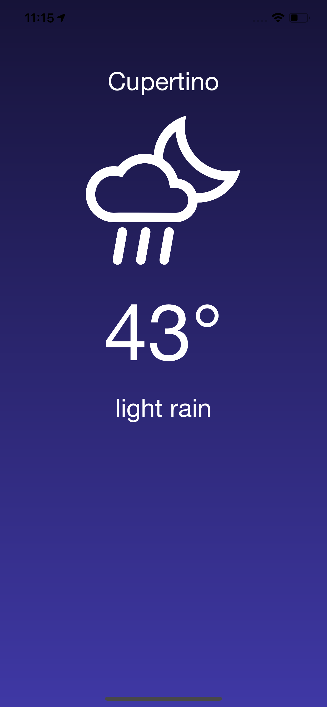

# WeatherApp
A minimalist weather app with REST API

## Introduction
This is a minimalist weather app using OpenWeatherMap's API. It features a minimalist design and shows the current weather for the user's location.

## Features
* Uses CoreLocation to retrieve the user's current location
* Minimalist Design
* Custom weather icons 

## Screenshots

## Requirements
* iOS 10+
* Swift 4
